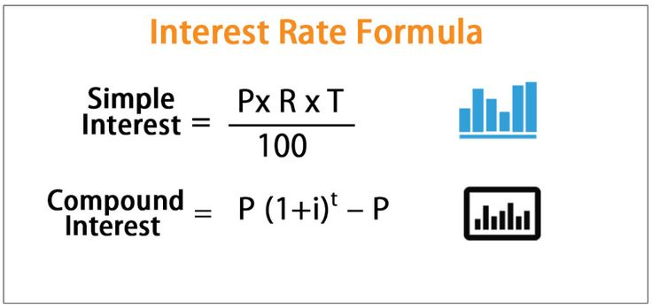

# Simple Interest

## Overview
In this assignment, you are to develop a program to calculate the amount of simple interest earned on a given principal.  The following graphic provides the formula to calculate both the simple interest and compound interest:

  
  
  * Reference: https://www.calculator.net/simple-interest-calculator.html

## Objectives
   1. To practice the development process provided by the Professor from the `04-first-programming-assignment`.
      * In this assignment, you must use branches.
      * The [Programming Workflow](./programming_workflow.md) file has been provided to aid you in this process.
      * Refer back the the `04-first-programming-assignment` as needed.

   1. To illustrated that the order of operations, while using fix-sized integers, is important to obtain accurate answers.
      * That is to say the following equation is NOT always true!
        ```
        R/100 * T * P == P * T * R/100
        ```

   1. To exercise the native MIPS instructions for multiple and divide: `mult`, `div`, `mflo`, and `mfhi`.


## Specifications and Limitations

   1. You must use branches as demonstrated by the [Programming Workflow](./programming_workflow.md) document.
      * A branch must exist for the tasks:  'java', 'java_tac', and 'mips'.
      * Each branch must have at least 4 commits.
      * Each branch must be merged into the main branch.
      * A submission tag must exist for each branch: 'java_submitted', 'java_tac_submitted', 'mips_submitted'.
      * Such tags must be associated with a commit that created prior to the due date.

   1. You are limited to the following TAC and MIPS instructions

      | TAC Subroutine                | MIPS Instruction          |
      |-------------------------------|---------------------------|
      | `return a;`                   | `move $v0, a`             |
      |                               | `jr $ra`                  |
      | `return imm;`                 | `li $v0, imm`             |
      |                               | `jr $ra`                  |

      | TAC Equations                 | MIPS Instructions         |
      |-------------------------------|---------------------------|
      | `;`                           | `nop`                     |
      | `x = imm;`                    | `li x, imm`               |
      | `x = - imm;`                  | `subi x, $zero, imm`      |
      | `x = - a;`                    | `sub  x, $zero, a`        |
      | `x = a;`                      | `move x, a`               |
      | `x = a <op_i> imm; `          | `<op_i> x, a, imm`        |
      | `x = a <op> b;`               | `<op> x, a, b`            |
      | `x = ~ a;`                    | `nor x, a, $zero`         |


      1. Java Instructions with one immediate value:  `x = a <op_i> imm;`
         - `MIPS <op_i>  <- Java operator`
           * addi: +, subi: -, ori: |, andi: &, xori: ^
      1. Java Instructions with two variables: `x = a <op> b;`
         - `MIPS <op>  <- Java operator`
           * add: +, sub: -, or: |, and: &, xor: ^,


      | TAC Mult / Div Equations      | MIPS Instruction          |
      |-------------------------------|---------------------------|
      | `x = a * b;`                  | `mult a, b`               |
      |                               | `mflo x`                  |
      |                               |                           |
      | `x = a / b;`                  | `div a, b`                |
      |                               | `mflo x`                  |
      |                               |                           |
      | `x = a % b;`                  | `div a, b`                |
      |                               | `mfhi x`                  |
      |                               |                           |
 

      | Java TAC                      | MIPS Macro                |
      |-------------------------------|---------------------------|
      | `mips.print_d(a);`            | `print_d(a)`              |
      | `mips.print_di(imm);`         | `print_di(imm)`           |
      | ... etc                       |                           |


## Tasks
Note that these instructions presume that the current working directory is: `~/classes/comp122/deliverables/41-simple-interest-{account}`.

### Test_cases:
  1. Create at least two test cases within the file `test_cases/{account}.sth_case`. 
     * See the file `test_cases/{smf-steve}.sth_case` as an example.

  1. Trade your test cases with at least two other students. Place these files into your `test_cases` directory.  E.g., 
     - `test_cases/{student_1}.sth_case`
     - `test_cases/{student_2}.sth_case`

  1. Add and commit these test cases to your local repository:
     ```bash
     git add test_cases/{account}.sth_case
     git add test_cases/{student_1}.sth_case
     git add test_cases/{student_2}.sth_case
     git commit -m 'adding shared test_cases'
     ```


### Java: `simple_interest.j`  

  1. Start the `java` Task with the file `java/simple_interest.j` (see [Programming Workflow](./programming_flow.md))
  1. Incrementally Work on the `java` Task  
     * Write a Java Method to compute ``SI = R/100 * T * P``
       - Insert the following starter code into your java/simple_interest.j file
         ```java
         // Simple Interest:
         //
         // SI = R / 100 * P * T;
         // where
         //   P  = Principal, i.e., your investment
         //   R  = interest Rate, e.g., 3 for 3% / year
         //   T  = number of Terms in years.

         public static int simple_interest(int P, int R, int T) {
   
           int SI;

           // Insert your code here

           mips.print_d(SI);
           mips.print_ci('\n');
           return 0;
         }
         ```
   
       - Continue to edit `java/simple_interest.j` to compute ``SI``

     * Test your solution via `make test_java`
       * Note that the test cases should fail! 
              
     * Commit your changes to the repository: 
       ```bash
        git add java/simple_interest.j
        git commit -m "{message}" -a
        ```
       
    * Continue: continue working on your solution until you have a working solution.
      - You will need to revise your code to use the following formula: ``SI = (T * P * R ) /100``
      - Don't forget to update the comments in your solution.

  1. Finish your Java Task   


### Java_tac: `simple_interest.j`  
  1. Start the `java_tac` Task
  1. Incrementally Work on your `java_task` task
  1. Finish the `java_tac` task.


### MIPS: `simple_interest.s`
  1. Start the `mips` Task with the file `mips/simple_interest.s`
     - edit `mips/simple_interest.j` to include the following starter code.

       ```mips
                            .text
                            .globl simple_interest
                            .include "include/stack.s"
                            .include "include/syscalls.s"

       simple_interest:     nop
       ```
  1. Incrementally Work on your `mips` task
  1. Finish the `mips` task.


### Finish the assignment: 
At this point, you have completed the assignment and you have submitted it. But now you have a chance to "confirm" that when the Professor grades the assignment, it is based upon what you believe you submitted.

In short, perform one more test to make sure everything is as it should be.

  ```bash
  git switch main
  make confirm
  ```

Make any alterations to your previous work to ensure you maximize your score.  Note you must remember to reset and to republish your "submission" tags correctly.  The tags are what the Professor uses to determine *what* to grade.


